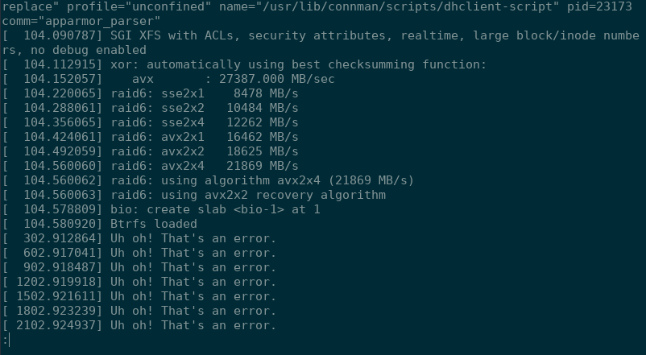
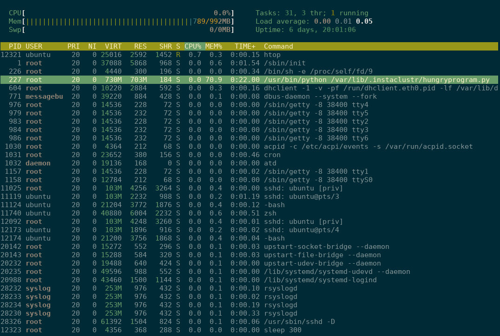

### General Administration

#### Tue, 15th August 2017

Once I received the pem file, this afternoon I logged into the EC2 instance with the command.

``` bash

    sudo ssh -i instaclustr-test-key.pem  ubuntu@54.219.187.53 -p 2222
```

##### Health Checks
Moving on, now that I was inside the EC2 instance I performed the following checks:

- *dmesg* - (display message or driver message) is a command on most Unix-like operating systems that prints the message buffer of the kernel. The output of this command typically contains the messages produced by the device drivers.


**Results**

The results from dmesg gave me a whole lot of "Uh oh! That's an error." that continues on and on.




- *checked syslog* 

**Results**

More error messages from kernel again and this time logger showing another Error. I used scp to copy it accross to my laptop for record keeping.

[syslog output](https://github.com/PenguinRage/Interview_challenge/blob/master/q2/evidence/syslog)


- *top* - program provides a dynamic real-time view of a running system. In my case I used htop.


**Results**

Noticed mem usage was high, looked for the source of high usage and determined it to be a python script. Furthermore from the python script I determined the location of the hidden folder *(/var/lib/.instaclustr)* containing the location of the test programs.




**Other tools**
* netstat
* top
* vmstat
* pmap
* iostat
