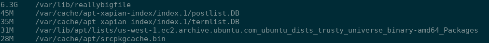

## General Administration

### Tue, 15th August 2017

Once I received the pem file, this afternoon I logged into the EC2 instance with the command.

``` bash

    sudo ssh -i instaclustr-test-key.pem  ubuntu@54.219.187.53 -p 2222
```

#### Health Checks
Moving on, now that I was inside the EC2 instance I performed the following checks:

#### Checked kernel messages  
- (display message or driver message) is a command on most Unix-like operating systems that prints the message buffer of the kernel. The output of this command typically contains the messages produced by the device drivers.

``` bash
    dmesg
```

**Results**

The results from dmesg gave me a whole lot of "Uh oh! That's an error." that continues on and on.


#### checked syslog 

``` bash
    cat /var/log/syslog
```

**Results**

More error messages from kernel from dmesg again and this time logger showing another Error. I used scp to copy it accross to my laptop for record keeping.

Output : [syslog output](./q2/evidence/syslog)


#### Checked current processes and Mem Usage

* top - program provides a dynamic real-time view of a running system. In my case I used htop.
* ps - report a snapshot of the current processes.


``` bash
    ps auxf | sort -nr -k 4 | head -10'

    htop

```

**Results**

Noticed mem usage was high, looked for the source of high usage and determined it to be a python script. Furthermore from the python script I determined the location of the hidden folder *(/var/lib/.instaclustr)* containing the location of the test programs.

Output : [get top 10 process eating memory](./q2/evidence/memusage)


#### Checked Diskspace
``` bash
    df -h
```
Output : [df output](./q2/evidence/diskspace)

Output implies that well something is using most of the secondary memory

Next for files with largest filesize
``` bash
    find / -type f -exec du -Sh {} + | sort -rh | head -n 5
```




**Other tools used**
* netstat
* vmstat
* pmap
* iostat
