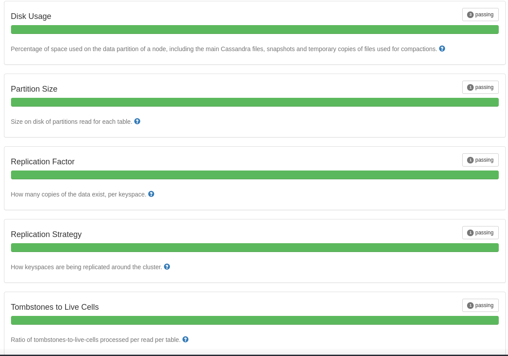

## Using Cassandra

### Tue, 15th August 2017

Note: Cassandra cluster was a trial base which has expired.

First time, using Cassandra, so here it goes.

#### Cluster Setup
* Created account, verified email.
* Login and clicked create cluster
* Set the cluster to the correct parameters, and then created new cluster.
* Once cluster was setup, I looked through the options available. Explicitly Connection Info.

#### My Setup
* Decided to use python not that it mattered which language
* Created virtual env for my machine, using my venv script found on root of repo
* installed cassandra-driver and any other dependencies through pip

#### Coding
* Began reading documentation
* Copied Connection python code and tested cluster connection
* Created keyspace through session.execute and csql using replication strategy {'class':'NetworkTopologyStrategy',  'AWS_VPC_US_EAST_1' : 3}
* Created table through session.execute and csql
* Added data through Cassandra driver prepared statements reading in the data with csv python library.

#### Cluster Health Check Status

