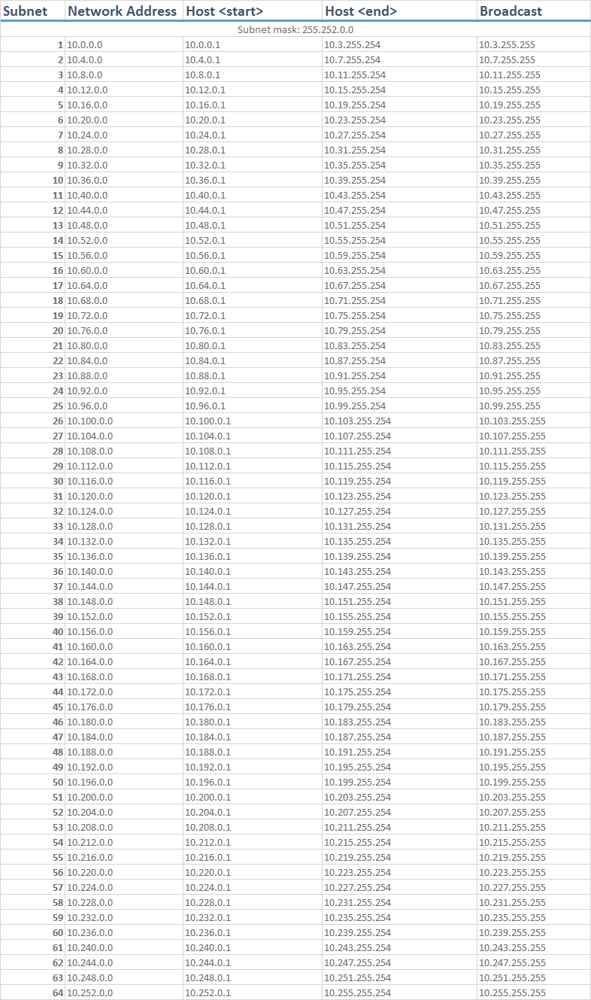

## Networking Theory

##### Given a /8 base network (e.g. 10.0.0.0) subnet it so there are at least 64 networks available

##### Explain what NAT/PAT are.
Network Address Translation (NAT) and Port Address Translation (PAT) both map IP addresses on an internal network to IP addresses on an external network. NAT (Network Address Translation) uses a pool of public addresses that are mapped one-to-one to the private (or "inside") addresses, keeping the port number intact. PAT (Port Address Translation) uses a single outside public address and maps multiple inside addresses to it using different port numbers.

##### Explain what a VPN is.
A Virtual Private Network (VPN) is a network technology that creates a secure network connection over a public network such as the Internet or a private network owned by a service provider. A VPN secures the private network, using encryption and other security mechanisms to ensure that only authorized users can access the network and that the data cannot be intercepted. This type of network is designed to provides a secure, encrypted tunnel in which to transmit the data between the remote user and the company network.
